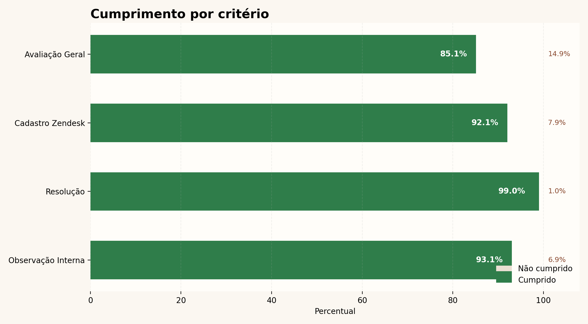
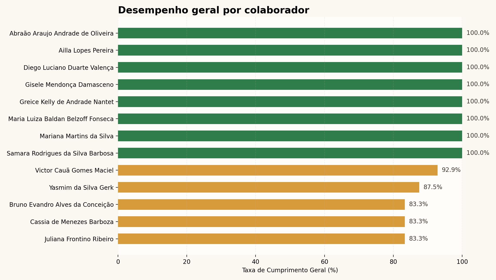

# Relatorio Semanal de Atendimentos Online - 27/04/2026 a 30/04/2026

**Data de Emissao:** 30/04/2026

## 1. Introducao

Este relatorio apresenta o desempenho dos atendimentos online com foco nos criterios Observacao Interna, Resolucao, Cadastro Zendesk e Avaliacao Geral do Atendimento.

## 2. Analise Consolidada dos Criterios

A tabela abaixo resume a taxa de cumprimento por criterio no periodo analisado.

| Criterio | Cumprido (%) | Nao Cumprido (%) | Total de Registros |
| --- | --- | --- | --- |
| Observacao Interna | 93.1% | 6.9% | 101 |
| Resolucao | 99.0% | 1.0% | 101 |
| Cadastro Zendesk | 92.1% | 7.9% | 101 |
| Avaliacao Geral do Atendimento | 85.1% | 14.9% | 101 |

## 3. Analise de Desempenho por Colaborador

O ranking a seguir mostra a taxa geral de cumprimento por colaborador com base nos criterios quantitativos aplicaveis.

| Colaborador | Taxa de Cumprimento Geral | Obs. Interna (C/NC) | Resolucao (C/NC) | Zendesk (C/NC) | Total de Atendimentos |
| --- | --- | --- | --- | --- | --- |
| Abraão Araujo Andrade de Oliveira | 100.0% | 8/0 | 8/0 | 8/0 | 8 |
| Ailla Lopes Pereira | 100.0% | 8/0 | 8/0 | 8/0 | 8 |
| Bruno Evandro Alves da Conceição | 83.3% | 4/4 | 8/0 | 8/0 | 8 |
| Cassia de Menezes Barboza | 83.3% | 7/1 | 8/0 | 5/3 | 8 |
| Diego Luciano Duarte Valença | 100.0% | 8/0 | 8/0 | 8/0 | 8 |
| Gisele Mendonça Damasceno | 100.0% | 8/0 | 8/0 | 8/0 | 8 |
| Greice Kelly de Andrade Nantet | 100.0% | 8/0 | 8/0 | 8/0 | 8 |
| Juliana Frontino Ribeiro | 83.3% | 7/1 | 8/0 | 5/3 | 8 |
| Maria Luiza Baldan Belzoff Fonseca | 100.0% | 6/0 | 6/0 | 6/0 | 6 |
| Mariana Martins da Silva | 100.0% | 8/0 | 8/0 | 8/0 | 8 |
| Samara Rodrigues da Silva Barbosa | 100.0% | 8/0 | 8/0 | 8/0 | 8 |
| Victor Cauã Gomes Maciel | 92.9% | 7/0 | 7/0 | 6/1 | 7 |
| Yasmim da Silva Gerk | 87.5% | 7/1 | 7/1 | 7/1 | 8 |

**Legenda:** `C/NC` = Cumprido / Nao Cumprido.

## 4. Observacoes Adicionais

### Observações Detalhadas

**Abraão Araujo Andrade de Oliveira** - 0 ponto(s) de atencao, 8 ponto(s) positivo(s)
- ✅ Ticket 38779 | Chat | Correto | Sem observação adicional.
- ✅ Ticket 38899 | Chat | Correto | Sem observação adicional.
- ✅ Ticket 39447 | Chat | Correto | Sem observação adicional.
- ✅ Ticket 39511 | Chat | Correto | Sem observação adicional.
- ✅ Ticket 39831 | Chat | Correto | Sem observação adicional.
- ✅ Ticket 40068 | Chat | Correto | Sem observação adicional.
- ✅ Ticket 40435 | Chat | Correto | Sem observação adicional.
- ✅ Ticket 40524 | Chat | Correto | Sem observação adicional.

**Ailla Lopes Pereira** - 0 ponto(s) de atencao, 8 ponto(s) positivo(s)
- ✅ Ticket 38707 | Chat | Correto | Enviado avaliação final
- ✅ Ticket 39191 | Chat | Correto | Enviado avaliação final
- ✅ Ticket 39656 | Chat | Correto | Enviado avaliação final
- ✅ Ticket 39704 | Chat | Correto | Sem observação adicional.
- ✅ Ticket 39841 | Chat | Correto | Enviado avaliação final
- ✅ Ticket 39859 | Chat | Correto | Enviado avaliação final
- ✅ Ticket 40388 | Chat | Correto | Enviado avaliação final
- ✅ Ticket 40490 | Chat | Correto | Enviado avaliação final

**Bruno Evandro Alves da Conceição** - 4 ponto(s) de atencao, 4 ponto(s) positivo(s)
- ⚠️ Ticket 38670 | Chat | Atenção | Sem observação adicional.
- ⚠️ Ticket 39186 | Chat | Atenção | Enviado avaliação final
- ⚠️ Ticket 39493 | Chat | Atenção | Sem observação adicional.
- ⚠️ Ticket 39711 | Chat | Atenção | Sem observação adicional.
- ✅ Ticket 40196 | Chat | Correto | Sem observação adicional.
- ✅ Ticket 40224 | Chat | Correto | Enviado avaliação final
- ✅ Ticket 40422 | Email | Correto | Sem observação adicional.
- ✅ Ticket 40478 | Email | Correto | Sem observação adicional.

**Cassia de Menezes Barboza** - 4 ponto(s) de atencao, 4 ponto(s) positivo(s)
- ✅ Ticket 38802 | Email | Correto | Sem observação adicional.
- ⚠️ Ticket 38948 | Chat | Atenção | Sem observação adicional.
- ⚠️ Ticket 39289 | Chat | Atenção | Sem observação adicional.
- ✅ Ticket 39296 | Chat | Correto | Sem observação adicional.
- ⚠️ Ticket 39787 | Email | Atenção | Sem observação adicional.
- ⚠️ Ticket 40214 | Email | Atenção | Sem observação adicional.
- ✅ Ticket 40389 | Ligação | Correto | Sem observação adicional.
- ✅ Ticket 40420 | Chat | Correto | Sem observação adicional.

**Diego Luciano Duarte Valença** - 0 ponto(s) de atencao, 8 ponto(s) positivo(s)
- ✅ Ticket 39126 | Chat | Correto | Enviado avaliação final
- ✅ Ticket 39152 | Chat | Correto | Sem observação adicional.
- ✅ Ticket 39394 | Chat | Correto | Sem observação adicional.
- ✅ Ticket 39734 | Chat | Correto | Sem observação adicional.
- ✅ Ticket 40295 | Chat | Correto | Sem observação adicional.
- ✅ Ticket 40329 | Chat | Correto | Sem observação adicional.
- ✅ Ticket 40434 | Chat | Correto | Enviado avaliação final
- ✅ Ticket 40673 | Ligação | Correto | Sem observação adicional.

**Gisele Mendonça Damasceno** - 0 ponto(s) de atencao, 8 ponto(s) positivo(s)
- ✅ Ticket 39118 | Chat | Correto | Sem observação adicional.
- ✅ Ticket 39146 | Chat | Correto | Sem observação adicional.
- ✅ Ticket 39425 | Chat | Correto | Sem observação adicional.
- ✅ Ticket 39474 | Chat | Correto | Sem observação adicional.
- ✅ Ticket 40177 | Chat | Correto | Sem observação adicional.
- ✅ Ticket 40293 | Chat | Correto | Sem observação adicional.
- ✅ Ticket 40496 | Chat | Correto | Sem observação adicional.
- ✅ Ticket 40561 | Chat | Correto | Sem observação adicional.

**Greice Kelly de Andrade Nantet** - 0 ponto(s) de atencao, 8 ponto(s) positivo(s)
- ✅ Ticket 39157 | Chat | Correto | Enviado avaliação final
- ✅ Ticket 39159 | Chat | Correto | Enviado avaliação final
- ✅ Ticket 39619 | Chat | Correto | Sem observação adicional.
- ✅ Ticket 39661 | Chat | Correto | Sem observação adicional.
- ✅ Ticket 39867 | Chat | Correto | Sem observação adicional.
- ✅ Ticket 40069 | Chat | Correto | Enviado avaliação final
- ✅ Ticket 40371 | Chat | Correto | Enviado avaliação final
- ✅ Ticket 40482 | Chat | Correto | Enviado avaliação final

**Juliana Frontino Ribeiro** - 4 ponto(s) de atencao, 4 ponto(s) positivo(s)
- ✅ Ticket 38832 | Chat | Correto | Enviado avaliação final
- ⚠️ Ticket 38940 | Chat | Atenção | Enviado avaliação final
- ⚠️ Ticket 39465 | Chat | Atenção | Sem observação adicional.
- ⚠️ Ticket 39615 | Chat | Atenção | Sem observação adicional.
- ⚠️ Ticket 40075 | Chat | Atenção | Sem observação adicional.
- ✅ Ticket 40147 | Chat | Correto | Enviado avaliação final
- ✅ Ticket 40549 | Chat | Correto | Sem observação adicional.
- ✅ Ticket 40649 | Chat | Correto | Sem observação adicional.

**Maria Luiza Baldan Belzoff Fonseca** - 0 ponto(s) de atencao, 6 ponto(s) positivo(s)
- ✅ Ticket 38974 | Chat | Correto | Sem observação adicional.
- ✅ Ticket 39184 | Chat | Correto | Sem observação adicional.
- ✅ Ticket 39531 | Chat | Correto | Sem observação adicional.
- ✅ Ticket 39715 | Chat | Correto | Enviado avaliação final
- ✅ Ticket 39823 | Chat | Correto | Sem observação adicional.
- ✅ Ticket 39902 | Chat | Correto | Enviado avaliação final

**Mariana Martins da Silva** - 0 ponto(s) de atencao, 8 ponto(s) positivo(s)
- ✅ Ticket 39060 | Chat | Correto | Sem observação adicional.
- ✅ Ticket 39125 | Chat | Correto | Sem observação adicional.
- ✅ Ticket 39735 | Chat | Correto | Sem observação adicional.
- ✅ Ticket 39750 | Chat | Correto | Enviado avaliação final
- ✅ Ticket 40140 | Chat | Correto | Enviado avaliação final
- ✅ Ticket 40153 | Chat | Correto | Enviado avaliação final
- ✅ Ticket 40446 | Chat | Correto | Sem observação adicional.
- ✅ Ticket 40475 | Chat | Correto | Enviado avaliação final

**Samara Rodrigues da Silva Barbosa** - 0 ponto(s) de atencao, 8 ponto(s) positivo(s)
- ✅ Ticket 38795 | Chat | Correto | Sem observação adicional.
- ✅ Ticket 38929 | Chat | Correto | Sem observação adicional.
- ✅ Ticket 39318 | Chat | Correto | Sem observação adicional.
- ✅ Ticket 39482 | Chat | Correto | Sem observação adicional.
- ✅ Ticket 39796 | Chat | Correto | Sem observação adicional.
- ✅ Ticket 40084 | Chat | Correto | Sem observação adicional.
- ✅ Ticket 40423 | Chat | Correto | Enviado avaliação final
- ✅ Ticket 40552 | Chat | Correto | Enviado avaliação final

**Victor Cauã Gomes Maciel** - 1 ponto(s) de atencao, 6 ponto(s) positivo(s)
- ✅ Ticket 38913 | Ligação | Correto | Sem observação adicional.
- ✅ Ticket 38995 | Ligação | Correto | Sem observação adicional.
- ✅ Ticket 39435 | Ligação | Correto | Sem observação adicional.
- ⚠️ Ticket 39899 | Ligação | Atenção | Sem observação adicional.
- ✅ Ticket 39971 | Ligação | Correto | Sem observação adicional.
- ✅ Ticket 40453 | Ligação | Correto | Sem observação adicional.
- ✅ Ticket 40474 | Ligação | Correto | Sem observação adicional.

**Yasmim da Silva Gerk** - 2 ponto(s) de atencao, 6 ponto(s) positivo(s)
- ✅ Ticket 38746 | Chat | Correto | Sem observação adicional.
- ✅ Ticket 39015 | Ligação | Correto | Sem observação adicional.
- ⚠️ Ticket 39322 | Chat | Atenção | Sem observação adicional.
- ⚠️ Ticket 39501 | Ligação | Atenção | Sem observação adicional.
- ✅ Ticket 39845 | Ligação | Correto | Sem observação adicional.
- ✅ Ticket 39933 | Chat | Correto | Sem observação adicional.
- ✅ Ticket 40533 | Ligação | Correto | Sem observação adicional.
- ✅ Ticket 40607 | Email | Correto | Sem observação adicional.

## 5. Conclusoes e Recomendacoes

- **Pontos Fortes:** O critério de Resolução continua apresentando um bom desempenho geral, indicando que a equipe tem sido eficaz nesse aspecto do atendimento.
- **Pontos de Melhoria:** Cadastro Zendesk e Observação Interna são os pontos que necessitam de maior atenção, com percentuais de cumprimento que indicam oportunidades de melhoria.
- **Recomendacoes:**
1.1 Treinamento Contínuo: Reforçar treinamentos sobre a importância e o processo correto de registro na Zendesk e a qualidade das observações internas.

Atenciosamente, Hemily Marques
