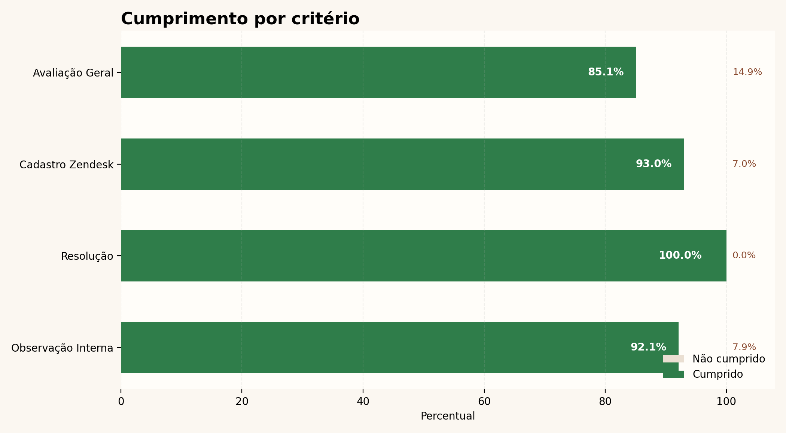
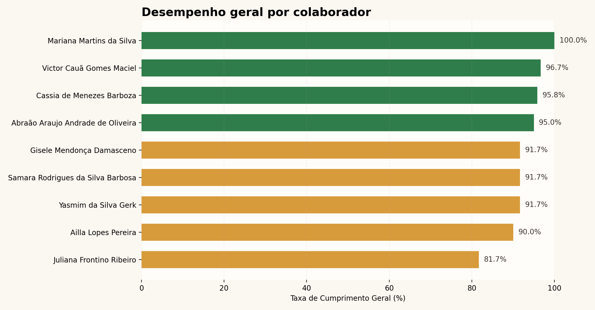

# Relatorio Semanal de Atendimentos Online - 01/06/2026 a 29/05/2039

**Data de Emissao:** 08/06/2026

## 1. Introducao

Este relatorio apresenta o desempenho dos atendimentos online com foco nos criterios Observacao Interna, Resolucao, Cadastro Zendesk e Avaliacao Geral do Atendimento.

## 2. Analise Consolidada dos Criterios

A tabela abaixo resume a taxa de cumprimento por criterio no periodo analisado.

| Criterio | Cumprido (%) | Nao Cumprido (%) | Total de Registros |
| --- | --- | --- | --- |
| Observacao Interna | 88.1% | 11.9% | 193 |
| Resolucao | 100.0% | 0.0% | 193 |
| Cadastro Zendesk | 87.0% | 13.0% | 193 |
| Avaliacao Geral do Atendimento | 76.2% | 23.8% | 193 |

## 3. Analise de Desempenho por Colaborador

O ranking a seguir mostra a taxa geral de cumprimento por colaborador com base nos criterios quantitativos aplicaveis.

| Colaborador | Taxa de Cumprimento Geral | Obs. Interna (C/NC) | Resolucao (C/NC) | Zendesk (C/NC) | Total de Atendimentos |
| --- | --- | --- | --- | --- | --- |
| Abraão Araujo Andrade de Oliveira | 95.8% | 16/0 | 16/0 | 14/2 | 16 |
| Ailla Lopes Pereira | 93.8% | 16/0 | 16/0 | 13/3 | 16 |
| Bruno Evandro Alves da Conceição | 93.9% | 10/1 | 11/0 | 10/1 | 11 |
| Cassia de Menezes Barboza | 70.8% | 9/7 | 16/0 | 9/7 | 16 |
| Diego Luciano Duarte Valença | 95.8% | 14/2 | 16/0 | 16/0 | 16 |
| Gisele Mendonça Damasceno | 97.9% | 16/0 | 16/0 | 15/1 | 16 |
| Greice Kelly de Andrade Nantet | 100.0% | 12/0 | 12/0 | 12/0 | 12 |
| Juliana Frontino Ribeiro | 83.3% | 10/6 | 16/0 | 14/2 | 16 |
| Maria Luiza Baldan Belzoff Fonseca | 88.9% | 8/4 | 12/0 | 12/0 | 12 |
| Mariana Martins da Silva | 100.0% | 16/0 | 16/0 | 16/0 | 16 |
| Samara Rodrigues da Silva Barbosa | 89.6% | 13/3 | 16/0 | 14/2 | 16 |
| Victor Cauã Gomes Maciel | 92.9% | 14/0 | 14/0 | 11/3 | 14 |
| Yasmim da Silva Gerk | 91.7% | 16/0 | 16/0 | 12/4 | 16 |

**Legenda:** `C/NC` = Cumprido / Nao Cumprido.

## 4. Observacoes Adicionais

### Observações Detalhadas

**Abraão Araujo Andrade de Oliveira** - 3 ponto(s) de atencao, 13 ponto(s) positivo(s)
- ✅ Ticket 50360 | Chat | Correto | Sem observação adicional.
- ✅ Ticket 50486 | Chat | Correto | Sem observação adicional.
- ⚠️ Ticket 50519 | Chat | Atenção | Atendeu interessaso sendo de experiência
- ✅ Ticket 50531 | Chat | Correto | Sem observação adicional.
- ✅ Ticket 50773 | Chat | Correto | Sem observação adicional.
- ✅ Ticket 50830 | Chat | Correto | Sem observação adicional.
- ✅ Ticket 50835 | Chat | Correto | Sem observação adicional.
- ⚠️ Ticket 50941 | Redes Sociais | Atenção | Sem observação adicional.
- ✅ Ticket 51186 | Chat | Correto | Sem observação adicional.
- ✅ Ticket 51307 | Chat | Correto | Sem observação adicional.
- ✅ Ticket 51410 | Chat | Correto | Sem observação adicional.
- ✅ Ticket 51451 | Chat | Correto | Sem observação adicional.
- ✅ Ticket 51739 | Redes Sociais | Correto | Sem observação adicional.
- ✅ Ticket 51756 | Chat | Correto | Sem observação adicional.
- ⚠️ Ticket 51795 | Chat | Atenção | Sem observação adicional.
- ✅ Ticket 51882 | Chat | Correto | Sem observação adicional.

**Ailla Lopes Pereira** - 3 ponto(s) de atencao, 13 ponto(s) positivo(s)
- ✅ Ticket 50120 | Chat | Correto | Sem observação adicional.
- ✅ Ticket 50173 | Email | Correto | Sem observação adicional.
- ✅ Ticket 50466 | Chat | Correto | Sem observação adicional.
- ✅ Ticket 50622 | Chat | Correto | Enviado avaliação final
- ✅ Ticket 50818 | Chat | Correto | Enviado avaliação final
- ⚠️ Ticket 51044 | Chat | Atenção | Enviado avaliação final
- ✅ Ticket 51064 | Chat | Correto | Enviado avaliação final
- ✅ Ticket 51100 | Chat | Correto | Sem observação adicional.
- ✅ Ticket 51208 | Chat | Correto | Sem observação adicional.
- ✅ Ticket 51407 | Chat | Correto | Enviado avaliação final
- ✅ Ticket 51575 | Chat | Correto | Enviado avaliação final
- ⚠️ Ticket 51596 | Chat | Atenção | Sem observação adicional.
- ⚠️ Ticket 51748 | Chat | Atenção | Enviado avaliação final
- ✅ Ticket 51772 | Ligação | Correto | Sem observação adicional.
- ✅ Ticket 51857 | Ligação | Correto | Sem observação adicional.
- ✅ Ticket 51996 | Chat | Correto | Enviado avaliação final

**Bruno Evandro Alves da Conceição** - 2 ponto(s) de atencao, 9 ponto(s) positivo(s)
- ✅ Ticket 50484 | Email | Correto | Sem observação adicional.
- ✅ Ticket 50645 | Redes Sociais | Correto | Enviado avaliação final
- ✅ Ticket 50855 | Chat | Correto | Sem observação adicional.
- ✅ Ticket 51006 | Chat | Correto | Sem observação adicional.
- ✅ Ticket 51243 | Chat | Correto | Sem observação adicional.
- ⚠️ Ticket 51432 | Chat | Atenção | Sem observação adicional.
- ✅ Ticket 51552 | Email | Correto | Sem observação adicional.
- ✅ Ticket 51701 | Chat | Correto | Sem observação adicional.
- ⚠️ Ticket 51950 | Chat | Atenção | Sem observação adicional.
- ✅ Ticket 51976 | Chat | Correto | Sem observação adicional.
- ✅ Ticket 51997 | Chat | Correto | Sem observação adicional.

**Cassia de Menezes Barboza** - 11 ponto(s) de atencao, 5 ponto(s) positivo(s)
- ⚠️ Ticket 50253 | Email | Atenção | Sem observação adicional.
- ⚠️ Ticket 50377 | Email | Atenção | Sem observação adicional.
- ✅ Ticket 50407 | Redes Sociais | Correto | Sem observação adicional.
- ✅ Ticket 50430 | Chat | Correto | Enviado avaliação final
- ⚠️ Ticket 50869 | Email | Atenção | Sem observação adicional.
- ⚠️ Ticket 51027 | Email | Atenção | Sem observação adicional.
- ⚠️ Ticket 51036 | Email | Atenção | Sem observação adicional.
- ✅ Ticket 51052 | Ligação | Correto | Sem observação adicional.
- ⚠️ Ticket 51349 | Chat | Atenção | Sem observação adicional.
- ⚠️ Ticket 51446 | Email | Atenção | Sem observação adicional.
- ⚠️ Ticket 51614 | Email | Atenção | Sem observação adicional.
- ⚠️ Ticket 51624 | Email | Atenção | Sem observação adicional.
- ✅ Ticket 51746 | Email | Correto | Sem observação adicional.
- ✅ Ticket 51872 | Email | Correto | Sem observação adicional.
- ⚠️ Ticket 51927 | Email | Atenção | Sem observação adicional.
- ⚠️ Ticket 51980 | Ligação | Atenção | Sem observação adicional.

**Diego Luciano Duarte Valença** - 2 ponto(s) de atencao, 14 ponto(s) positivo(s)
- ⚠️ Ticket 50454 | Chat | Atenção | Sem observação adicional.
- ✅ Ticket 50458 | Chat | Correto | Enviado avaliação final
- ✅ Ticket 50492 | Chat | Correto | Enviado avaliação final
- ✅ Ticket 50681 | Chat | Correto | Enviado avaliação final
- ✅ Ticket 50873 | Chat | Correto | Sem observação adicional.
- ✅ Ticket 50895 | Chat | Correto | Sem observação adicional.
- ✅ Ticket 51087 | Chat | Correto | Sem observação adicional.
- ✅ Ticket 51099 | Chat | Correto | Enviado avaliação final
- ✅ Ticket 51339 | Chat | Correto | Enviado avaliação final
- ✅ Ticket 51369 | Chat | Correto | Enviado avaliação final
- ✅ Ticket 51540 | Redes Sociais | Correto | Sem observação adicional.
- ✅ Ticket 51609 | Ligação | Correto | Sem observação adicional.
- ✅ Ticket 51840 | Ligação | Correto | Sem observação adicional.
- ⚠️ Ticket 51982 | Email | Atenção | Sem observação adicional.
- ✅ Ticket 52044 | Chat | Correto | Enviado avaliação final
- ✅ Ticket 52067 | Ligação | Correto | Sem observação adicional.

**Gisele Mendonça Damasceno** - 1 ponto(s) de atencao, 15 ponto(s) positivo(s)
- ✅ Ticket 50553 | Chat | Correto | Sem observação adicional.
- ✅ Ticket 50585 | Chat | Correto | Sem observação adicional.
- ✅ Ticket 50627 | Chat | Correto | Sem observação adicional.
- ✅ Ticket 50651 | Chat | Correto | Sem observação adicional.
- ✅ Ticket 50862 | Chat | Correto | Sem observação adicional.
- ✅ Ticket 50901 | Chat | Correto | Sem observação adicional.
- ✅ Ticket 50985 | Redes Sociais | Correto | Sem observação adicional.
- ✅ Ticket 51071 | Redes Sociais | Correto | Sem observação adicional.
- ✅ Ticket 51329 | Chat | Correto | Sem observação adicional.
- ⚠️ Ticket 51367 | Chat | Atenção | Sem observação adicional.
- ✅ Ticket 51391 | Chat | Correto | Sem observação adicional.
- ✅ Ticket 51499 | Chat | Correto | Sem observação adicional.
- ✅ Ticket 51805 | Redes Sociais | Correto | Sem observação adicional.
- ✅ Ticket 51873 | Ligação | Correto | Sem observação adicional.
- ✅ Ticket 51981 | Chat | Correto | Sem observação adicional.
- ✅ Ticket 52063 | Chat | Correto | Sem observação adicional.

**Greice Kelly de Andrade Nantet** - 0 ponto(s) de atencao, 12 ponto(s) positivo(s)
- ✅ Ticket 50596 | Chat | Correto | Enviado avaliação final
- ✅ Ticket 50619 | Chat | Correto | Enviado avaliação final
- ✅ Ticket 50629 | Chat | Correto | Enviado avaliação final
- ✅ Ticket 50660 | Chat | Correto | Enviado avaliação final
- ✅ Ticket 50994 | Chat | Correto | Enviado avaliação final
- ✅ Ticket 51003 | Chat | Correto | Sem observação adicional.
- ✅ Ticket 51079 | Chat | Correto | Enviado avaliação final
- ✅ Ticket 51093 | Chat | Correto | Enviado avaliação final
- ✅ Ticket 51797 | Chat | Correto | Sem observação adicional.
- ✅ Ticket 51800 | Chat | Correto | Sem observação adicional.
- ✅ Ticket 51965 | Chat | Correto | Enviado avaliação final
- ✅ Ticket 51984 | Chat | Correto | Sem observação adicional.

**Juliana Frontino Ribeiro** - 8 ponto(s) de atencao, 8 ponto(s) positivo(s)
- ✅ Ticket 50381 | Chat | Correto | Enviado avaliação final
- ✅ Ticket 50385 | Chat | Correto | Sem observação adicional.
- ⚠️ Ticket 50446 | Chat | Atenção | Sem observação adicional.
- ✅ Ticket 50606 | Chat | Correto | Sem observação adicional.
- ✅ Ticket 50760 | Redes Sociais | Correto | Sem observação adicional.
- ⚠️ Ticket 50821 | Redes Sociais | Atenção | Sem observação adicional.
- ⚠️ Ticket 50870 | Chat | Atenção | Sem observação adicional.
- ✅ Ticket 51012 | Chat | Correto | Sem observação adicional.
- ⚠️ Ticket 51171 | Chat | Atenção | Sem observação adicional.
- ⚠️ Ticket 51211 | Chat | Atenção | Sem observação adicional.
- ⚠️ Ticket 51228 | Chat | Atenção | Sem observação adicional.
- ✅ Ticket 51371 | Chat | Correto | Enviado avaliação final
- ⚠️ Ticket 51758 | Email | Atenção | Sem observação adicional.
- ✅ Ticket 51783 | Chat | Correto | Sem observação adicional.
- ⚠️ Ticket 51880 | Chat | Atenção | Sem observação adicional.
- ✅ Ticket 51969 | Redes Sociais | Correto | Sem observação adicional.

**Maria Luiza Baldan Belzoff Fonseca** - 4 ponto(s) de atencao, 8 ponto(s) positivo(s)
- ✅ Ticket 50164 | Chat | Correto | Sem observação adicional.
- ✅ Ticket 50762 | Chat | Correto | Sem observação adicional.
- ✅ Ticket 50946 | Chat | Correto | Sem observação adicional.
- ✅ Ticket 51002 | Chat | Correto | Sem observação adicional.
- ✅ Ticket 51163 | Chat | Correto | Sem observação adicional.
- ⚠️ Ticket 51416 | Chat | Atenção | Sem observação adicional.
- ✅ Ticket 51421 | Ligação | Correto | Sem observação adicional.
- ✅ Ticket 51429 | Chat | Correto | Sem observação adicional.
- ⚠️ Ticket 51751 | Redes Sociais | Atenção | Sem observação adicional.
- ⚠️ Ticket 51774 | Chat | Atenção | Sem observação adicional.
- ✅ Ticket 51914 | Chat | Correto | Sem observação adicional.
- ⚠️ Ticket 51940 | Chat | Atenção | Sem observação adicional.

**Mariana Martins da Silva** - 0 ponto(s) de atencao, 16 ponto(s) positivo(s)
- ✅ Ticket 50574 | Chat | Correto | Enviado avaliação final
- ✅ Ticket 50615 | Chat | Correto | Enviado avaliação final
- ✅ Ticket 50628 | Chat | Correto | Sem observação adicional.
- ✅ Ticket 50682 | Chat | Correto | Sem observação adicional.
- ✅ Ticket 50976 | Chat | Correto | Sem observação adicional.
- ✅ Ticket 51011 | Chat | Correto | Sem observação adicional.
- ✅ Ticket 51041 | Chat | Correto | Sem observação adicional.
- ✅ Ticket 51074 | Chat | Correto | Sem observação adicional.
- ✅ Ticket 51458 | Chat | Correto | Enviado avaliação final
- ✅ Ticket 51477 | Chat | Correto | Enviado avaliação final
- ✅ Ticket 51536 | Chat | Correto | Enviado avaliação final
- ✅ Ticket 51543 | Chat | Correto | Enviado avaliação final
- ✅ Ticket 51830 | Chat | Correto | Enviado avaliação final
- ✅ Ticket 51978 | Chat | Correto | Enviado avaliação final
- ✅ Ticket 52004 | Chat | Correto | Enviado avaliação final
- ✅ Ticket 52059 | Chat | Correto | Enviado avaliação final

**Samara Rodrigues da Silva Barbosa** - 5 ponto(s) de atencao, 11 ponto(s) positivo(s)
- ✅ Ticket 50169 | Redes Sociais | Correto | Sem observação adicional.
- ✅ Ticket 50307 | Chat | Correto | Sem observação adicional.
- ⚠️ Ticket 50311 | Chat | Atenção | Enviado avaliação final
- ✅ Ticket 50589 | Redes Sociais | Correto | Enviado avaliação final
- ✅ Ticket 50794 | Ligação | Correto | Sem observação adicional.
- ✅ Ticket 50839 | Ligação | Correto | Sem observação adicional.
- ✅ Ticket 50918 | Chat | Correto | Sem observação adicional.
- ✅ Ticket 50919 | Ligação | Correto | Sem observação adicional.
- ✅ Ticket 51218 | Ligação | Correto | Sem observação adicional.
- ✅ Ticket 51232 | Chat | Correto | Sem observação adicional.
- ✅ Ticket 51403 | Chat | Correto | Enviado avaliação final
- ⚠️ Ticket 51442 | Chat | Atenção | Sem observação adicional.
- ✅ Ticket 51695 | Redes Sociais | Correto | Sem observação adicional.
- ⚠️ Ticket 51832 | Chat | Atenção | Sem observação adicional.
- ⚠️ Ticket 51875 | Chat | Atenção | Sem observação adicional.
- ⚠️ Ticket 51908 | Chat | Atenção | Sem observação adicional.

**Victor Cauã Gomes Maciel** - 3 ponto(s) de atencao, 11 ponto(s) positivo(s)
- ✅ Ticket 50374 | Ligação | Correto | Sem observação adicional.
- ✅ Ticket 50397 | Ligação | Correto | Sem observação adicional.
- ⚠️ Ticket 50434 | Ligação | Atenção | Sem observação adicional.
- ✅ Ticket 50451 | Ligação | Correto | Sem observação adicional.
- ✅ Ticket 50837 | Ligação | Correto | Sem observação adicional.
- ⚠️ Ticket 50952 | Ligação | Atenção | Sem observação adicional.
- ✅ Ticket 51010 | Email | Correto | Sem observação adicional.
- ✅ Ticket 51047 | Ligação | Correto | Sem observação adicional.
- ✅ Ticket 51363 | Ligação | Correto | Sem observação adicional.
- ✅ Ticket 51454 | Ligação | Correto | Sem observação adicional.
- ✅ Ticket 51780 | Ligação | Correto | Sem observação adicional.
- ⚠️ Ticket 51799 | Ligação | Atenção | Sem observação adicional.
- ✅ Ticket 51862 | Ligação | Correto | Sem observação adicional.
- ✅ Ticket 51896 | Ligação | Correto | Sem observação adicional.

**Yasmim da Silva Gerk** - 4 ponto(s) de atencao, 12 ponto(s) positivo(s)
- ✅ Ticket 50316 | Ligação | Correto | Sem observação adicional.
- ✅ Ticket 50325 | Ligação | Correto | Sem observação adicional.
- ✅ Ticket 50372 | Ligação | Correto | Sem observação adicional.
- ⚠️ Ticket 50575 | Chat | Atenção | Sem observação adicional.
- ✅ Ticket 50782 | Ligação | Correto | Sem observação adicional.
- ✅ Ticket 50814 | Chat | Correto | Sem observação adicional.
- ✅ Ticket 50903 | Chat | Correto | Sem observação adicional.
- ✅ Ticket 50933 | Ligação | Correto | Sem observação adicional.
- ✅ Ticket 51190 | Email | Correto | Sem observação adicional.
- ⚠️ Ticket 51202 | Chat | Atenção | Sem observação adicional.
- ⚠️ Ticket 51244 | Chat | Atenção | Sem observação adicional.
- ✅ Ticket 51324 | Ligação | Correto | Sem observação adicional.
- ⚠️ Ticket 51755 | Chat | Atenção | Sem observação adicional.
- ✅ Ticket 51827 | Chat | Correto | Sem observação adicional.
- ✅ Ticket 51838 | Ligação | Correto | Sem observação adicional.
- ✅ Ticket 51915 | Ligação | Correto | Sem observação adicional.

## 5. Conclusoes e Recomendacoes

- **Pontos Fortes:** O critério de Resolução continua apresentando um bom desempenho geral, indicando que a equipe tem sido eficaz nesse aspecto do atendimento.
- **Pontos de Melhoria:** Cadastro Zendesk e Observação Interna são os pontos que necessitam de maior atenção, com percentuais de cumprimento que indicam oportunidades de melhoria.
- **Recomendacoes:**
1.1 Treinamento Contínuo: Reforçar treinamentos sobre a importância e o processo correto de registro na Zendesk e a qualidade das observações internas.

Atenciosamente, Hemily Marques
